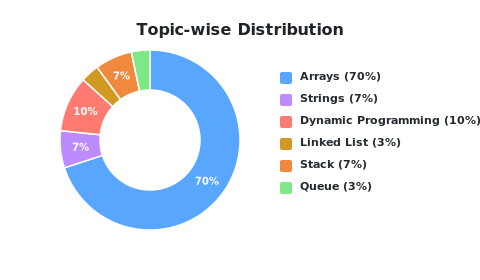

# leetcode-problem-solve
A collection of LeetCode questions to ace the coding interview! - Created using [LeetHub v2](https://github.com/arunbhardwaj/LeetHub-2.0)

<!---LeetCode Topics Start-->
# LeetCode Topics
## Array
|  |
| ------- |
| [0011-container-with-most-water](https://github.com/santoshkumarmahato17/leetcode-problem-solve/tree/master/0011-container-with-most-water) |
| [0015-3sum](https://github.com/santoshkumarmahato17/leetcode-problem-solve/tree/master/0015-3sum) |
| [0018-4sum](https://github.com/santoshkumarmahato17/leetcode-problem-solve/tree/master/0018-4sum) |
| [0026-remove-duplicates-from-sorted-array](https://github.com/santoshkumarmahato17/leetcode-problem-solve/tree/master/0026-remove-duplicates-from-sorted-array) |
| [0027-remove-element](https://github.com/santoshkumarmahato17/leetcode-problem-solve/tree/master/0027-remove-element) |
| [0042-trapping-rain-water](https://github.com/santoshkumarmahato17/leetcode-problem-solve/tree/master/0042-trapping-rain-water) |
| [0075-sort-colors](https://github.com/santoshkumarmahato17/leetcode-problem-solve/tree/master/0075-sort-colors) |
| [0080-remove-duplicates-from-sorted-array-ii](https://github.com/santoshkumarmahato17/leetcode-problem-solve/tree/master/0080-remove-duplicates-from-sorted-array-ii) |
| [0084-largest-rectangle-in-histogram](https://github.com/santoshkumarmahato17/leetcode-problem-solve/tree/master/0084-largest-rectangle-in-histogram) |
| [0088-merge-sorted-array](https://github.com/santoshkumarmahato17/leetcode-problem-solve/tree/master/0088-merge-sorted-array) |
| [0209-minimum-size-subarray-sum](https://github.com/santoshkumarmahato17/leetcode-problem-solve/tree/master/0209-minimum-size-subarray-sum) |
| [0283-move-zeroes](https://github.com/santoshkumarmahato17/leetcode-problem-solve/tree/master/0283-move-zeroes) |
| [0643-maximum-average-subarray-i](https://github.com/santoshkumarmahato17/leetcode-problem-solve/tree/master/0643-maximum-average-subarray-i) |
| [0658-find-k-closest-elements](https://github.com/santoshkumarmahato17/leetcode-problem-solve/tree/master/0658-find-k-closest-elements) |
| [0845-longest-mountain-in-array](https://github.com/santoshkumarmahato17/leetcode-problem-solve/tree/master/0845-longest-mountain-in-array) |
| [0905-sort-array-by-parity](https://github.com/santoshkumarmahato17/leetcode-problem-solve/tree/master/0905-sort-array-by-parity) |
| [0922-sort-array-by-parity-ii](https://github.com/santoshkumarmahato17/leetcode-problem-solve/tree/master/0922-sort-array-by-parity-ii) |
| [0977-squares-of-a-sorted-array](https://github.com/santoshkumarmahato17/leetcode-problem-solve/tree/master/0977-squares-of-a-sorted-array) |
| [1250-check-if-it-is-a-good-array](https://github.com/santoshkumarmahato17/leetcode-problem-solve/tree/master/1250-check-if-it-is-a-good-array) |
| [1984-minimum-difference-between-highest-and-lowest-of-k-scores](https://github.com/santoshkumarmahato17/leetcode-problem-solve/tree/master/1984-minimum-difference-between-highest-and-lowest-of-k-scores) |
## Math
|  |
| ------- |
| [0050-powx-n](https://github.com/santoshkumarmahato17/leetcode-problem-solve/tree/master/0050-powx-n) |
| [0070-climbing-stairs](https://github.com/santoshkumarmahato17/leetcode-problem-solve/tree/master/0070-climbing-stairs) |
| [1250-check-if-it-is-a-good-array](https://github.com/santoshkumarmahato17/leetcode-problem-solve/tree/master/1250-check-if-it-is-a-good-array) |
## Number Theory
|  |
| ------- |
| [1250-check-if-it-is-a-good-array](https://github.com/santoshkumarmahato17/leetcode-problem-solve/tree/master/1250-check-if-it-is-a-good-array) |
## Two Pointers
|  |
| ------- |
| [0011-container-with-most-water](https://github.com/santoshkumarmahato17/leetcode-problem-solve/tree/master/0011-container-with-most-water) |
| [0015-3sum](https://github.com/santoshkumarmahato17/leetcode-problem-solve/tree/master/0015-3sum) |
| [0018-4sum](https://github.com/santoshkumarmahato17/leetcode-problem-solve/tree/master/0018-4sum) |
| [0026-remove-duplicates-from-sorted-array](https://github.com/santoshkumarmahato17/leetcode-problem-solve/tree/master/0026-remove-duplicates-from-sorted-array) |
| [0027-remove-element](https://github.com/santoshkumarmahato17/leetcode-problem-solve/tree/master/0027-remove-element) |
| [0042-trapping-rain-water](https://github.com/santoshkumarmahato17/leetcode-problem-solve/tree/master/0042-trapping-rain-water) |
| [0075-sort-colors](https://github.com/santoshkumarmahato17/leetcode-problem-solve/tree/master/0075-sort-colors) |
| [0080-remove-duplicates-from-sorted-array-ii](https://github.com/santoshkumarmahato17/leetcode-problem-solve/tree/master/0080-remove-duplicates-from-sorted-array-ii) |
| [0088-merge-sorted-array](https://github.com/santoshkumarmahato17/leetcode-problem-solve/tree/master/0088-merge-sorted-array) |
| [0125-valid-palindrome](https://github.com/santoshkumarmahato17/leetcode-problem-solve/tree/master/0125-valid-palindrome) |
| [0283-move-zeroes](https://github.com/santoshkumarmahato17/leetcode-problem-solve/tree/master/0283-move-zeroes) |
| [0344-reverse-string](https://github.com/santoshkumarmahato17/leetcode-problem-solve/tree/master/0344-reverse-string) |
| [0658-find-k-closest-elements](https://github.com/santoshkumarmahato17/leetcode-problem-solve/tree/master/0658-find-k-closest-elements) |
| [0845-longest-mountain-in-array](https://github.com/santoshkumarmahato17/leetcode-problem-solve/tree/master/0845-longest-mountain-in-array) |
| [0905-sort-array-by-parity](https://github.com/santoshkumarmahato17/leetcode-problem-solve/tree/master/0905-sort-array-by-parity) |
| [0922-sort-array-by-parity-ii](https://github.com/santoshkumarmahato17/leetcode-problem-solve/tree/master/0922-sort-array-by-parity-ii) |
| [0977-squares-of-a-sorted-array](https://github.com/santoshkumarmahato17/leetcode-problem-solve/tree/master/0977-squares-of-a-sorted-array) |
## Greedy
|  |
| ------- |
| [0011-container-with-most-water](https://github.com/santoshkumarmahato17/leetcode-problem-solve/tree/master/0011-container-with-most-water) |
## Sorting
|  |
| ------- |
| [0015-3sum](https://github.com/santoshkumarmahato17/leetcode-problem-solve/tree/master/0015-3sum) |
| [0018-4sum](https://github.com/santoshkumarmahato17/leetcode-problem-solve/tree/master/0018-4sum) |
| [0075-sort-colors](https://github.com/santoshkumarmahato17/leetcode-problem-solve/tree/master/0075-sort-colors) |
| [0088-merge-sorted-array](https://github.com/santoshkumarmahato17/leetcode-problem-solve/tree/master/0088-merge-sorted-array) |
| [0658-find-k-closest-elements](https://github.com/santoshkumarmahato17/leetcode-problem-solve/tree/master/0658-find-k-closest-elements) |
| [0905-sort-array-by-parity](https://github.com/santoshkumarmahato17/leetcode-problem-solve/tree/master/0905-sort-array-by-parity) |
| [0922-sort-array-by-parity-ii](https://github.com/santoshkumarmahato17/leetcode-problem-solve/tree/master/0922-sort-array-by-parity-ii) |
| [0977-squares-of-a-sorted-array](https://github.com/santoshkumarmahato17/leetcode-problem-solve/tree/master/0977-squares-of-a-sorted-array) |
| [1984-minimum-difference-between-highest-and-lowest-of-k-scores](https://github.com/santoshkumarmahato17/leetcode-problem-solve/tree/master/1984-minimum-difference-between-highest-and-lowest-of-k-scores) |
## String
|  |
| ------- |
| [0125-valid-palindrome](https://github.com/santoshkumarmahato17/leetcode-problem-solve/tree/master/0125-valid-palindrome) |
| [0344-reverse-string](https://github.com/santoshkumarmahato17/leetcode-problem-solve/tree/master/0344-reverse-string) |
## Binary Search
|  |
| ------- |
| [0209-minimum-size-subarray-sum](https://github.com/santoshkumarmahato17/leetcode-problem-solve/tree/master/0209-minimum-size-subarray-sum) |
| [0658-find-k-closest-elements](https://github.com/santoshkumarmahato17/leetcode-problem-solve/tree/master/0658-find-k-closest-elements) |
## Sliding Window
|  |
| ------- |
| [0209-minimum-size-subarray-sum](https://github.com/santoshkumarmahato17/leetcode-problem-solve/tree/master/0209-minimum-size-subarray-sum) |
| [0643-maximum-average-subarray-i](https://github.com/santoshkumarmahato17/leetcode-problem-solve/tree/master/0643-maximum-average-subarray-i) |
| [0658-find-k-closest-elements](https://github.com/santoshkumarmahato17/leetcode-problem-solve/tree/master/0658-find-k-closest-elements) |
| [1984-minimum-difference-between-highest-and-lowest-of-k-scores](https://github.com/santoshkumarmahato17/leetcode-problem-solve/tree/master/1984-minimum-difference-between-highest-and-lowest-of-k-scores) |
## Heap (Priority Queue)
|  |
| ------- |
| [0658-find-k-closest-elements](https://github.com/santoshkumarmahato17/leetcode-problem-solve/tree/master/0658-find-k-closest-elements) |
## Dynamic Programming
|  |
| ------- |
| [0042-trapping-rain-water](https://github.com/santoshkumarmahato17/leetcode-problem-solve/tree/master/0042-trapping-rain-water) |
| [0070-climbing-stairs](https://github.com/santoshkumarmahato17/leetcode-problem-solve/tree/master/0070-climbing-stairs) |
| [0845-longest-mountain-in-array](https://github.com/santoshkumarmahato17/leetcode-problem-solve/tree/master/0845-longest-mountain-in-array) |
## Enumeration
|  |
| ------- |
| [0845-longest-mountain-in-array](https://github.com/santoshkumarmahato17/leetcode-problem-solve/tree/master/0845-longest-mountain-in-array) |
## Stack
|  |
| ------- |
| [0042-trapping-rain-water](https://github.com/santoshkumarmahato17/leetcode-problem-solve/tree/master/0042-trapping-rain-water) |
| [0084-largest-rectangle-in-histogram](https://github.com/santoshkumarmahato17/leetcode-problem-solve/tree/master/0084-largest-rectangle-in-histogram) |
## Monotonic Stack
|  |
| ------- |
| [0042-trapping-rain-water](https://github.com/santoshkumarmahato17/leetcode-problem-solve/tree/master/0042-trapping-rain-water) |
| [0084-largest-rectangle-in-histogram](https://github.com/santoshkumarmahato17/leetcode-problem-solve/tree/master/0084-largest-rectangle-in-histogram) |
## Recursion
|  |
| ------- |
| [0050-powx-n](https://github.com/santoshkumarmahato17/leetcode-problem-solve/tree/master/0050-powx-n) |
## Memoization
|  |
| ------- |
| [0070-climbing-stairs](https://github.com/santoshkumarmahato17/leetcode-problem-solve/tree/master/0070-climbing-stairs) |
## Prefix Sum
|  |
| ------- |
| [0209-minimum-size-subarray-sum](https://github.com/santoshkumarmahato17/leetcode-problem-solve/tree/master/0209-minimum-size-subarray-sum) |
<!---LeetCode Topics End-->

<!-- START_LEETCODE_STATS -->
### 📊 LeetCode Progress & Stats

#### 🏆 Solved Problems Summary
- **Total Solved:** `24`
- **Last Updated:** `2026-06-26 03:38:02 India Standard Time`

#### 📈 Topic-wise Distribution Chart

  <picture>
    <source media="(prefers-color-scheme: dark)" srcset="leetcode_stats_dark.svg">
    <source media="(prefers-color-scheme: light)" srcset="leetcode_stats_light.svg">
    
  </picture>

#### 🔗 Clickable Topic Index & Legend
| Color | Topic | Solved Count | Percentage | Progress Bar |
| :---: | :--- | :---: | :---: | :---: |
| 🟦 | [**Arrays**](https://github.com/santoshkumarmahato17/leetcode-problem-solve/tree/master/Arrays) | `20` | `71%` | `███████░░░` |
| 🟪 | [**Strings**](https://github.com/santoshkumarmahato17/leetcode-problem-solve/tree/master/Strings) | `2` | `7%` | `█░░░░░░░░░` |
| 🟩 | [**Trees**](https://github.com/santoshkumarmahato17/leetcode-problem-solve/tree/master/Trees) | `0` | `0%` | `░░░░░░░░░░` |
| 🔷 | [**Graphs**](https://github.com/santoshkumarmahato17/leetcode-problem-solve/tree/master/Graphs) | `0` | `0%` | `░░░░░░░░░░` |
| 🟥 | [**Dynamic Programming**](https://github.com/santoshkumarmahato17/leetcode-problem-solve/tree/master/DynamicProgramming) | `3` | `11%` | `█░░░░░░░░░` |
| 🟨 | [**Linked List**](https://github.com/santoshkumarmahato17/leetcode-problem-solve/tree/master/LinkedList) | `0` | `0%` | `░░░░░░░░░░` |
| 🟧 | [**Stack**](https://github.com/santoshkumarmahato17/leetcode-problem-solve/tree/master/Stack) | `2` | `7%` | `█░░░░░░░░░` |
| 🔋 | [**Queue**](https://github.com/santoshkumarmahato17/leetcode-problem-solve/tree/master/Queue) | `1` | `4%` | `░░░░░░░░░░` |
| 🟫 | [**Hash Map**](https://github.com/santoshkumarmahato17/leetcode-problem-solve/tree/master/HashMap) | `0` | `0%` | `░░░░░░░░░░` |

#### 📂 Topic-wise Breakdowns

<b><a href="https://github.com/santoshkumarmahato17/leetcode-problem-solve/tree/master/Arrays">Arrays</a></b> (20 solved)

 

- [0011-container-with-most-water](https://github.com/santoshkumarmahato17/leetcode-problem-solve/tree/master/0011-container-with-most-water)
- [0015-3sum](https://github.com/santoshkumarmahato17/leetcode-problem-solve/tree/master/0015-3sum)
- [0018-4sum](https://github.com/santoshkumarmahato17/leetcode-problem-solve/tree/master/0018-4sum)
- [0026-remove-duplicates-from-sorted-array](https://github.com/santoshkumarmahato17/leetcode-problem-solve/tree/master/0026-remove-duplicates-from-sorted-array)
- [0027-remove-element](https://github.com/santoshkumarmahato17/leetcode-problem-solve/tree/master/0027-remove-element)
- [0042-trapping-rain-water](https://github.com/santoshkumarmahato17/leetcode-problem-solve/tree/master/0042-trapping-rain-water)
- [0075-sort-colors](https://github.com/santoshkumarmahato17/leetcode-problem-solve/tree/master/0075-sort-colors)
- [0080-remove-duplicates-from-sorted-array-ii](https://github.com/santoshkumarmahato17/leetcode-problem-solve/tree/master/0080-remove-duplicates-from-sorted-array-ii)
- [0084-largest-rectangle-in-histogram](https://github.com/santoshkumarmahato17/leetcode-problem-solve/tree/master/0084-largest-rectangle-in-histogram)
- [0088-merge-sorted-array](https://github.com/santoshkumarmahato17/leetcode-problem-solve/tree/master/0088-merge-sorted-array)
- [0209-minimum-size-subarray-sum](https://github.com/santoshkumarmahato17/leetcode-problem-solve/tree/master/0209-minimum-size-subarray-sum)
- [0283-move-zeroes](https://github.com/santoshkumarmahato17/leetcode-problem-solve/tree/master/0283-move-zeroes)
- [0643-maximum-average-subarray-i](https://github.com/santoshkumarmahato17/leetcode-problem-solve/tree/master/0643-maximum-average-subarray-i)
- [0658-find-k-closest-elements](https://github.com/santoshkumarmahato17/leetcode-problem-solve/tree/master/0658-find-k-closest-elements)
- [0845-longest-mountain-in-array](https://github.com/santoshkumarmahato17/leetcode-problem-solve/tree/master/0845-longest-mountain-in-array)
- [0905-sort-array-by-parity](https://github.com/santoshkumarmahato17/leetcode-problem-solve/tree/master/0905-sort-array-by-parity)
- [0922-sort-array-by-parity-ii](https://github.com/santoshkumarmahato17/leetcode-problem-solve/tree/master/0922-sort-array-by-parity-ii)
- [0977-squares-of-a-sorted-array](https://github.com/santoshkumarmahato17/leetcode-problem-solve/tree/master/0977-squares-of-a-sorted-array)
- [1250-check-if-it-is-a-good-array](https://github.com/santoshkumarmahato17/leetcode-problem-solve/tree/master/1250-check-if-it-is-a-good-array)
- [1984-minimum-difference-between-highest-and-lowest-of-k-scores](https://github.com/santoshkumarmahato17/leetcode-problem-solve/tree/master/1984-minimum-difference-between-highest-and-lowest-of-k-scores)

<b><a href="https://github.com/santoshkumarmahato17/leetcode-problem-solve/tree/master/Strings">Strings</a></b> (2 solved)

 

- [0125-valid-palindrome](https://github.com/santoshkumarmahato17/leetcode-problem-solve/tree/master/0125-valid-palindrome)
- [0344-reverse-string](https://github.com/santoshkumarmahato17/leetcode-problem-solve/tree/master/0344-reverse-string)

<b><a href="https://github.com/santoshkumarmahato17/leetcode-problem-solve/tree/master/Trees">Trees</a></b> (0 solved)

 

_No problems solved yet in this category._

<b><a href="https://github.com/santoshkumarmahato17/leetcode-problem-solve/tree/master/Graphs">Graphs</a></b> (0 solved)

 

_No problems solved yet in this category._

<b><a href="https://github.com/santoshkumarmahato17/leetcode-problem-solve/tree/master/DynamicProgramming">Dynamic Programming</a></b> (3 solved)

 

- [0042-trapping-rain-water](https://github.com/santoshkumarmahato17/leetcode-problem-solve/tree/master/0042-trapping-rain-water)
- [0070-climbing-stairs](https://github.com/santoshkumarmahato17/leetcode-problem-solve/tree/master/0070-climbing-stairs)
- [0845-longest-mountain-in-array](https://github.com/santoshkumarmahato17/leetcode-problem-solve/tree/master/0845-longest-mountain-in-array)

<b><a href="https://github.com/santoshkumarmahato17/leetcode-problem-solve/tree/master/LinkedList">Linked List</a></b> (0 solved)

 

_No problems solved yet in this category._

<b><a href="https://github.com/santoshkumarmahato17/leetcode-problem-solve/tree/master/Stack">Stack</a></b> (2 solved)

 

- [0042-trapping-rain-water](https://github.com/santoshkumarmahato17/leetcode-problem-solve/tree/master/0042-trapping-rain-water)
- [0084-largest-rectangle-in-histogram](https://github.com/santoshkumarmahato17/leetcode-problem-solve/tree/master/0084-largest-rectangle-in-histogram)

<b><a href="https://github.com/santoshkumarmahato17/leetcode-problem-solve/tree/master/Queue">Queue</a></b> (1 solved)

 

- [0658-find-k-closest-elements](https://github.com/santoshkumarmahato17/leetcode-problem-solve/tree/master/0658-find-k-closest-elements)

<b><a href="https://github.com/santoshkumarmahato17/leetcode-problem-solve/tree/master/HashMap">Hash Map</a></b> (0 solved)

 

_No problems solved yet in this category._

<!-- END_LEETCODE_STATS -->
